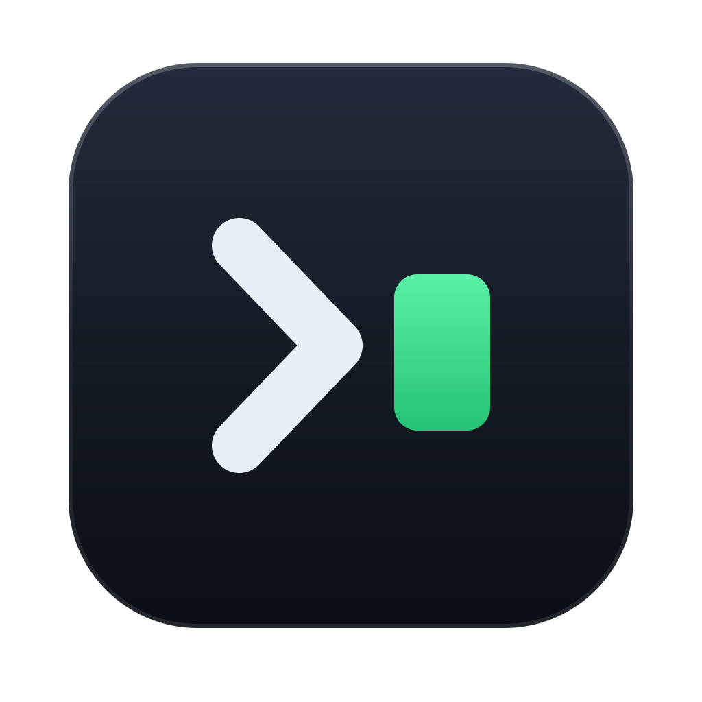

</img>

## Vimari
_Keyboard Shortcuts extension for Safari_

Vimari is a Safari extension that provides vim style keyboard based navigation.
This lets you control Safari from your keyboard instead of having to use your mouse to open links, scroll, etc.
The code is heavily based on [vimium](https://github.com/philc/vimium), a
Chrome extension that provides much more extensive features.

Vimari attempts to provide a lightweight port of vimium to Safari, taking the
best components of vimium and adapting them to Safari.

</img>

## Installation

Vimari 3 requires macOS 14 or later and Safari 26.2 or later.

1. Build and run `Vimari.xcodeproj` in Xcode after selecting your signing team for both targets.
2. Launch Vimari and click **Open in Safari Extensions Preferences**.
3. Enable Vimari and grant it access to the websites where you want keyboard navigation.
4. Add Vimari to Safari's toolbar. Clicking its toolbar button opens the settings page.

## Usage

### Settings
Open Vimari's extension settings from its Safari toolbar button or from Safari's
Extensions settings. Configuration remains JSON and is stored by Safari. The
settings page can save, reset, import, and export `userSettings.json` files.
Changes apply to open pages without a reload.

**Modifier** - Modifier key to hold down with your action key. If
you leave it blank you don't need to hold down anything (default
setting).

**Excluded URLs** - Comma separated list of website URLs you don't want
to use vimari with. To exclude GitHub for example, provide the value
`github.com` or `http://github.com`. It's smart and should handle all
possible domain cases.

**Link Hint Characters** - Allowed characters to be used when generating
link shortcuts.

**Extra detection by cursor style** - Detect clickable links by looking
for HTML elements having cursor style set to "pointer".

**Scroll Size** - How much each scroll will move on the page.

`Vimari v2.1+`

**Smooth Scroll** - Scroll smoothly through the page.

 **Normal vs Insert mode** - Isolate website keybindings from the
Vimari keybindings. In normal mode you can use the Vimari keybindings
while in insert mode you can use the websites own keybindings.

**Transparent Bindings** - Full keybinding isolation might not
be your style, instead the transparent bindings setting (when enabled)
allows you to use all **non-Vimari-bound** keys to interact with the web
page as if you were in insert mode.

**Multiple Bindings** - You can bind multiple keybindings to a Vimari
action. This is done by specifying an array of bindings in the 
configuration file, like so: `"goToPageTop": ["g g", "shift+k"]`.

### Keyboard Bindings

These bindings are the ones set by default, however you are able to change them in the settings.

#### In-page navigation
    f       Toggle links
    F       Toggle links (open link in new tab)
    k       Scroll up
    j       Scroll down
    h       Scroll left
    l       Scroll right
    u       Scroll up half page
    d       Scroll down half page
    g g     Go to top of page
    G       Go to bottom of page
    g i     Go to first input

#### Page/Tab navigation
    H       History back
    L       History forward
    r       Reload
    w       Next tab
    q       Previous tab
    x       Close current tab
    t       Open new tab

`Vimari v2.1+`

#### Vimari Modes
    i       Enter insert mode
    ESC     Enter normal mode
    CTRL+[  Enter normal mode
    
### Tips & Tricks

Vimari is built as a Safari Extension, this poses some limits on what is possible through the extension. However default Safari shortcuts can help you keep your hands at the keyboard. Some helpful ones are listed here:

- **Focus URL Bar** <kbd>⌘</kbd><kbd>l</kbd> - This is a feature not available in Vimari, it is also helpful where extensions are not loaded (for example on `topsites://`). By focusing the URL Bar you can go to a website where the extension is loaded.

- **Reader mode** <kbd>⇧</kbd><kbd>⌘</kbd><kbd>R</kbd> - Currently Vimari does not support entering Reader mode (due to API limitations), also navigation inside reader mode (for example using <kbd>j</kbd> or <kbd>k</kbd>) is not supported.

- **Re-open last closed tab** <kbd>⇧</kbd><kbd>⌘</kbd><kbd>T</kbd> - Allows you to reopen a recently closed tab.

## License

Copyright (C) 2011 Guy Halford-Thompson. See [LICENSE](LICENSE) for details.
